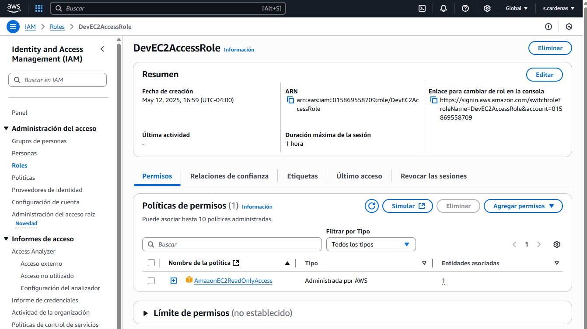
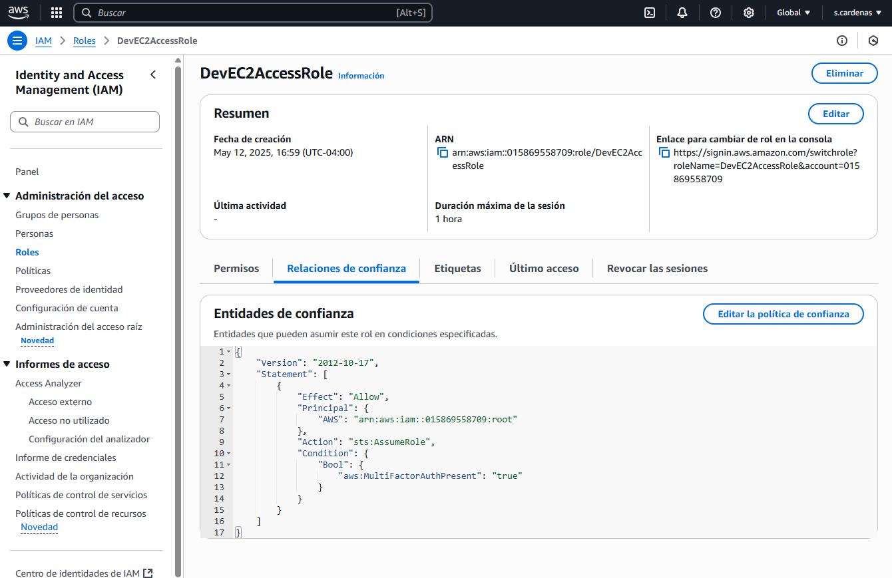
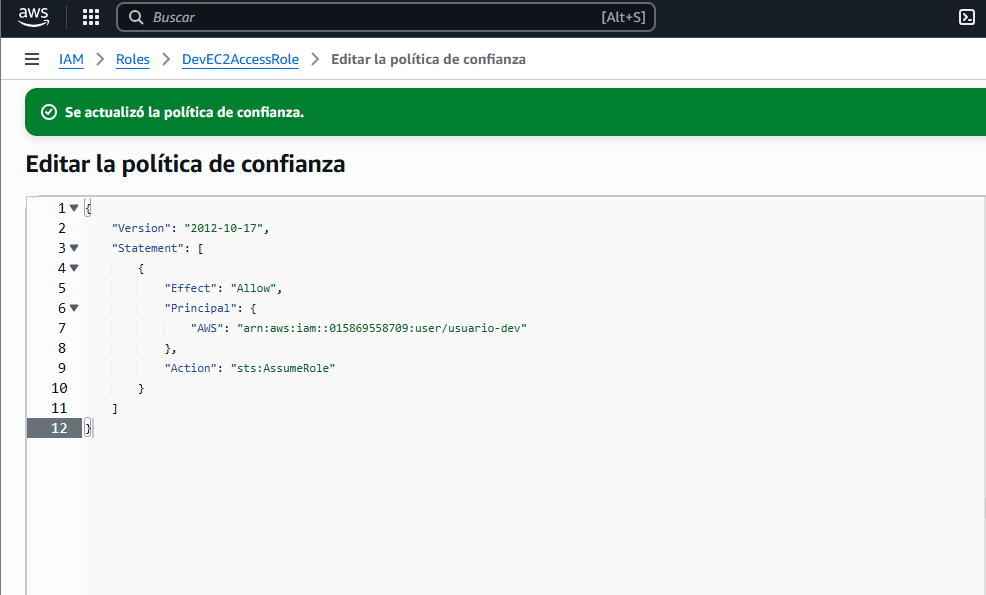
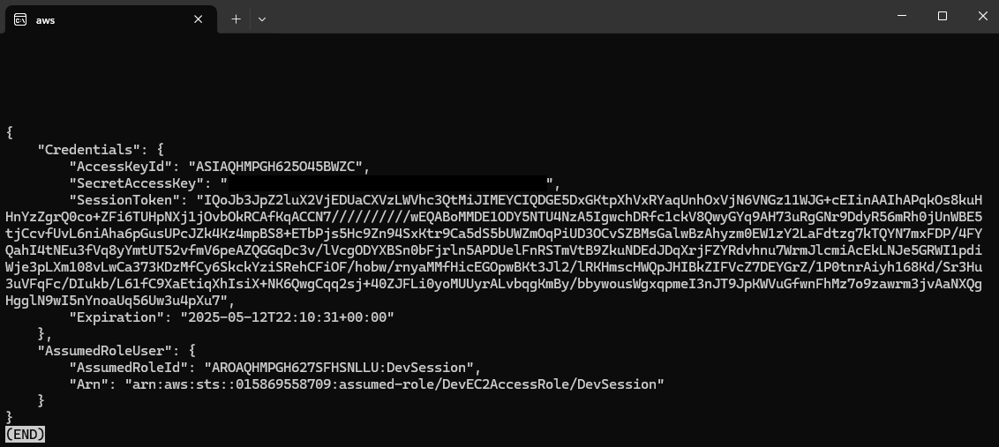
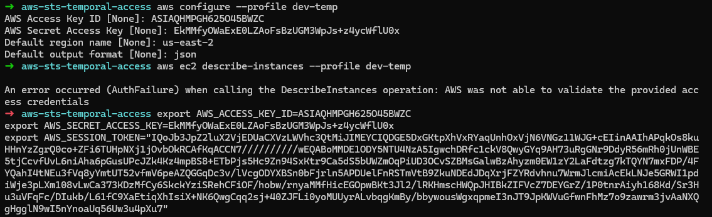
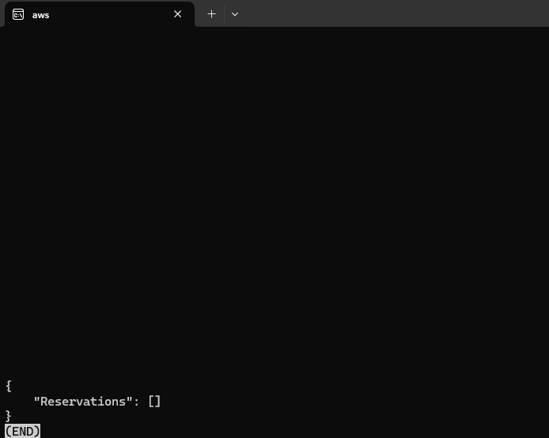

# Acceso temporal con roles (STS) en AWS

En este laboratorio se aprendió cómo permitir que un usuario sin permisos directos acceda temporalmente a ciertos servicios de AWS, como EC2, utilizando roles de IAM junto con Security Token Service (STS). La idea es evitar el uso de credenciales permanentes y mantener el control sobre qué acciones puede realizar ese usuario.

## Objetivos

- Habilitar el acceso temporal mediante `sts:AssumeRole`.
- Reemplazar credenciales fijas por sesiones controladas.
- Delegar permisos específicos sin necesidad de modificar directamente el perfil del usuario.

---

## Herramientas utilizadas

- AWS Console
- AWS IAM
- AWS CLI
- STS (Security Token Service)
- Ubuntu con WSL

---

## Estructura del repositorio

```
aws-sts-temporal-access/
├── screenshots/
│   ├── 01-crear-rol.png
│   ├── 02-relaciones-confianza.png
│   ├── 03-politica-confianza-modificada.png
│   ├── 04-assume-role-output.png
│   ├── 05-error-sin-token-y-export-correcto.png
│   └── 06-dev-temp-acceso-ec2.png
└── README.md
```

---

## Pasos realizados

### 1️⃣ Crear el rol `DevEC2AccessRole`
Rol con permiso `AmazonEC2ReadOnlyAccess` para que sea asumido por el usuario `usuario-dev`.



---

### 2️⃣ Revisar política de confianza inicial



---

### 3️⃣ Modificar política de confianza
Se permitió que el usuario `usuario-dev` asumiera el rol:

```json
"Principal": {
  "AWS": "arn:aws:iam::<ID>:user/usuario-dev"
}
```



---

### 4️⃣ Usuario `usuario-dev` asume el rol con STS

```bash
aws sts assume-role \
  --role-arn arn:aws:iam::<ID_CUENTA>:role/DevEC2AccessRole \
  --role-session-name DevSession \
  --profile dev
```



---

### 5️⃣ Error por falta de SessionToken al configurar con `aws configure`



---

### 6️⃣ Cargar credenciales temporales correctamente con variables de entorno

```bash
export AWS_ACCESS_KEY_ID=...
export AWS_SECRET_ACCESS_KEY=...
export AWS_SESSION_TOKEN=...
aws ec2 describe-instances --region us-east-2
```



---

Contacto: sebastian.cardenas.t@gmail.com

